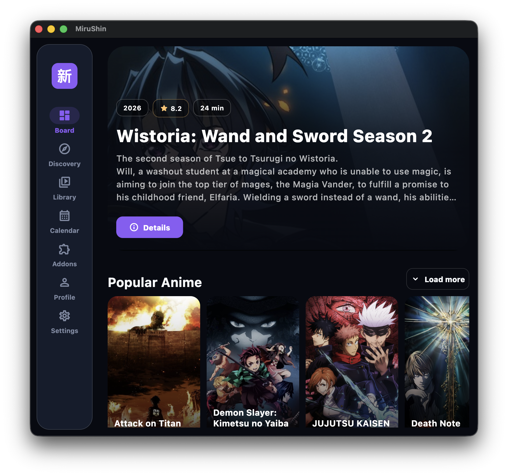
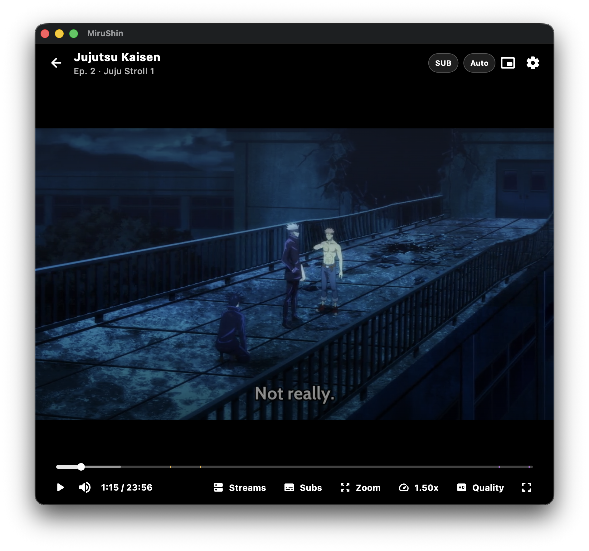

<p align="center">
  
</p>

<h1 align="center">MiruShin</h1>

<p align="center">
  <a href="https://github.com/emp0ry/MiruShin/releases/latest">
    
  </a>
  <a href="https://github.com/emp0ry/MiruShin/releases/latest">
    
  </a>
  <a href="https://www.buymeacoffee.com/emp0ry">
    
  </a>
  
  
  
  
  <a href="LICENSE">
    
  </a>
</p>

<p align="center">
MiruShin takes the familiar feel of AnimeShin and pushes it further with a cleaner Flutter architecture, a modular feature layout, real Sora module support, cross-platform playback, and deeper AniList profile flows.
</p>
<p align="center">
It can switch between TMDB-driven discovery and AniList-driven catalog views, then carry that context into your library, watch flow, and player experience from a single codebase.
</p>

## Highlights

| Area | What MiruShin does |
| --- | --- |
| Board and Discovery | Browse trending, popular, and filtered rails with cached metadata, search, and catalog mode switching between TMDB and AniList. |
| Library | Keep a local library, sync AniList folders, continue watching, manage statuses, and keep progress in one place. |
| Watch Flow | Use enabled Sora-compatible modules to search sources, choose seasons and episodes, and hand off cleanly into playback. |
| Player | Play HLS, MP4, and DASH streams with quality selection, voiceovers, subtitles, AniSkip markers, autoplay next, and progress sync. |
| Profile | Open AniList activities, favourites, feed, social pages, statistics, reviews, and export flows. |
| Polish | English, Russian, and Japanese UI, theme and accent settings, secure token storage, cache controls, and responsive desktop/mobile layouts. |

## Feature Notes

- Sora modules, shown as addons in the UI, are installable by manifest URL, can be enabled or reordered, and support import/export for local backups.
- Switch between TMDB and AniList by clicking the top-left logo. In compact mode, open `More` and use the catalog switch option there.
- Discord Rich Presence is available on supported desktop platforms.
- Picture in Picture and native player handoff are supported where the platform allows it.
- AniList exports are available for MyAnimeList XML and Shikimori JSON.

## Screenshots





## Getting Started

### Download

Prebuilt binaries are on the [Releases](https://github.com/emp0ry/MiruShin/releases/latest) page:

- **Android** - `.apk`
- **iOS** - `.ipa`
- **Windows** - installer (`.exe`) and portable `.zip`
- **macOS** - `.dmg`
- **Linux** - `AppImage`, `.tar.gz`, and `.deb` (Debian/Ubuntu)

### Requirements

- Flutter stable
- Dart SDK compatible with `sdk: ^3.11.4`

### Run Locally

```bash
git clone https://github.com/emp0ry/MiruShin.git
cd MiruShin
flutter pub get
flutter run
```

You can also run a specific target with commands like `flutter run -d macos`, `flutter run -d windows`, `flutter run -d linux`, or `flutter run -d android`.

## First-Time Setup

MiruShin is configured at runtime from the in-app Settings page. There is no `.env` file to edit for the normal setup flow.

### TMDB

TMDB powers the default metadata and discovery experience.

1. Create or open a TMDB developer application.
2. Copy your TMDB Read Access Token.
3. Open `Settings -> API Connections` in MiruShin.
4. Enable TMDB metadata and paste the token into `TMDB Read Access Token`.

The token is stored in platform secure storage and is not hardcoded in the repo.

### AniList

AniList powers profile pages, library sync, tracking, exports, and the AniList catalog mode.

Default client values in the app:

- Mobile client ID: `40342`
- Mobile redirect URI: `app://mirushin/auth`
- Desktop client ID: `40343`
- Desktop redirect URI: `http://localhost:28372/`

On mobile, the OAuth flow uses an embedded WebView callback. On desktop, MiruShin listens for a localhost callback.

### Sora Modules

Sora-compatible modules, shown as addons inside the app, unlock source search for watch pages.

1. Open the `Addons` page.
2. Paste a trusted module manifest JSON URL.
3. Preview the module.
4. Install and enable it.

MiruShin keeps a local working copy of installed modules and can update them later.

For information on how to get Sora addons, please join the [Sora Discord](https://discord.gg/XR3SrmUbpd) server.


## Support the Project

Love MiruShin? Fuel its development with a coffee!

[](https://www.buymeacoffee.com/emp0ry)

## Safety and Scope

- MiruShin is a media player and interface layer. It does not host or provide any content.
- MiruShin does not ship TMDB tokens, AniList tokens, Sora modules, module manifests, or media catalogs.
- Users are responsible for providing their own content and for ensuring they have the legal rights to access or use it.
- Users are responsible for complying with all applicable laws and for respecting copyright and intellectual property rights.
- Sora modules are third-party code and can make network requests. Only install modules from creators you trust.
- MiruShin includes no built-in Sora modules. Third-party modules are the responsibility of their creators, not MiruShin or `emp0ry`.
- Source access comes from user-installed modules, not from hardcoded providers bundled in this repository.
- The software is provided "as is" without warranties, and users bear full responsibility for how they use the app and any installed modules.
- This product uses the TMDB API but is not endorsed or certified by TMDB.

## Legal

- [License](LICENSE)
- [Privacy Policy](PRIVACY_POLICY.md)
- [Legal Notice](LEGAL.md)

## Project Layout

```text
lib/
  app/        # app shell, routing, theme, localization
  core/       # shared infrastructure, constants, widgets, cache, utilities
  features/   # domain-focused feature modules
  shared/     # app-wide models and shared data structures
```

Key feature areas:

- `features/board`, `features/discovery`, `features/calendar`
- `features/library`, `features/media_details`, `features/watch`
- `features/player`
- `features/profile`, `features/tracking`
- `features/addons`
- `features/settings`

## Built With

- Flutter
- Riverpod
- GoRouter
- Dio
- media_kit (mpv) and FVP for playback
- WebView Flutter
- Flutter Secure Storage

## Credits

- [TMDB](https://www.themoviedb.org/) for metadata and imagery
- [AniList](https://anilist.co/) for profile, tracking, and social data
- [Shikimori](https://shikimori.one/) for Russian-title enrichment flows
- [AniSkip](https://aniskip.com/) for OP/ED marker support
- [cranci1](https://github.com/cranci1), author of Sora and the Sora module ecosystem
